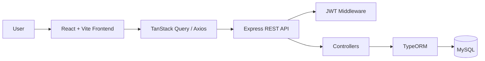
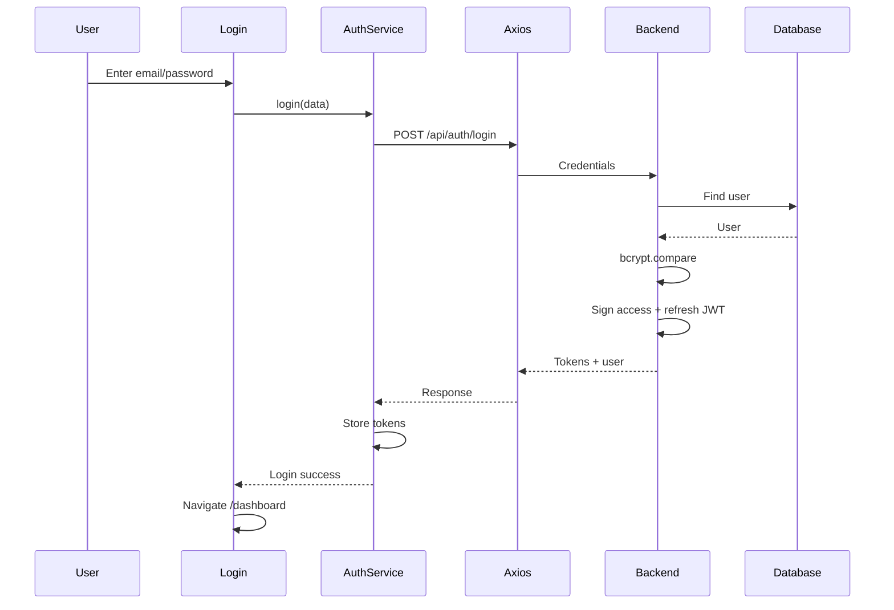
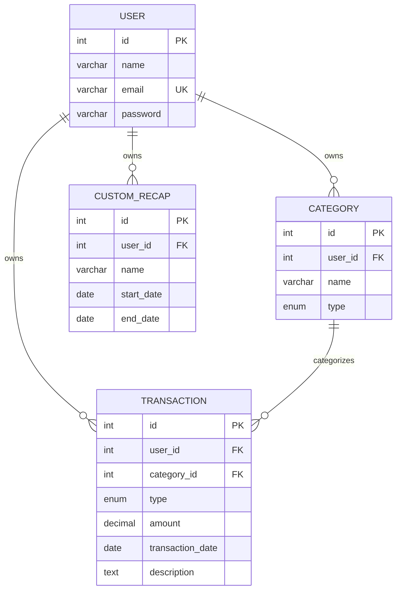
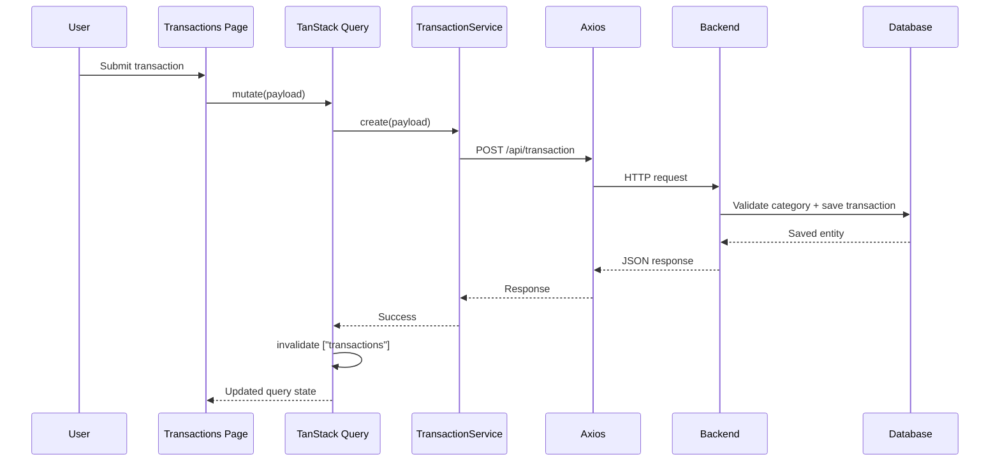

# Finance Tracker — Technical Documentation

> **Generated from source-code analysis of the uploaded `finance-tracker` repository.**
>
> Scope: Frontend + Backend + database/migrations + authentication + API + TanStack Query + configuration + deployment-related files.
>
> Evidence rule: this document describes implementation found in the repository. Where behavior cannot be established confidently from source, it is marked **UNKNOWN / NEED VERIFICATION**.

---

# --- GENERAL & SHARED ARCHITECTURE ---

# 01. Overview

## 1.1 Project purpose

`finance-tracker` is a personal finance tracking application with:

- User registration/login
- JWT authentication
- Access/refresh token flow
- User profile management
- Income/expense categories
- Transaction CRUD
- Transaction history and financial summary
- Custom recap/report periods
- Frontend dashboard and reporting views

The repository contains two independently runnable applications:

```text
finance-tracker/
├── frontend/
└── backend/
```

There is **no shared package/workspace package** visible in the repository structure analyzed. The frontend and backend therefore communicate through HTTP APIs rather than importing a shared domain package.

## 1.2 Repository structure

```text
finance-tracker/
├── frontend/
│   ├── src/
│   │   ├── api/
│   │   ├── components/
│   │   ├── config/
│   │   ├── contexts/
│   │   ├── hooks/
│   │   ├── pages/
│   │   ├── providers/
│   │   ├── routing/
│   │   ├── types/
│   │   └── styles/
│   ├── public/
│   ├── package.json
│   ├── vite.config.ts
│   ├── .env.example
│   └── vercel.json
│
├── backend/
│   ├── src/
│   │   ├── controllers/
│   │   ├── entities/
│   │   ├── helpers/
│   │   ├── langs/
│   │   ├── migrations/
│   │   ├── routes/
│   │   ├── swagger/
│   │   └── ...
│   ├── config/
│   ├── Dockerfile
│   ├── docker-compose.yml
│   ├── package.json
│   └── .env.example
│
└── Prompt Dokumentasi Teknis Monorepo FE + BE.md
```

## 1.3 Important file map

| Area | File | Responsibility |
|---|---|---|
| FE bootstrap | `frontend/src/main.tsx` | React application entry point |
| FE routing | `frontend/src/routing/app-routing-setup.tsx` | Route definitions |
| FE auth | `frontend/src/contexts/AuthContext.tsx` | Auth state and session lifecycle |
| FE auth guard | `frontend/src/routing/RequireAuth.tsx` | Protects authenticated routes |
| FE HTTP | `frontend/src/api/axiosInstance.ts` | Axios instance, auth header, refresh handling |
| FE tokens | `frontend/src/api/token.ts` | Access/refresh token storage and idle activity |
| FE server state | `frontend/src/providers/QueryProvider.tsx` | TanStack Query client |
| FE auth API | `frontend/src/api/auth.service.ts` | Login/register/refresh API |
| FE category API | `frontend/src/api/category.service.ts` | Category API |
| FE transaction API | `frontend/src/api/transaction.service.ts` | Transaction API |
| FE recap API | `frontend/src/api/custom-recap.service.ts` | Custom recap API |
| BE bootstrap | `backend/src/index.ts` | Starts HTTP/HTTPS server |
| BE app | `backend/src/server.ts` | Middleware, DB, routes, Swagger setup |
| BE routes | `backend/src/routes/public.ts` | Public endpoints |
| BE routes | `backend/src/routes/private.ts` | Authenticated endpoints |
| BE auth | `backend/src/controllers/auth.ts` | Authentication/profile operations |
| BE transaction | `backend/src/controllers/transaction.ts` | Transaction business logic |
| BE category | `backend/src/controllers/category.ts` | Category business logic |
| BE recap | `backend/src/controllers/custom-recap.ts` | Custom recap business logic |
| BE ORM | `backend/src/helpers/orm.ts` | TypeORM runtime connection |
| BE DB config | `backend/src/data-source.ts` | TypeORM migration DataSource |
| BE JWT | `backend/src/helpers/jwt.ts` | JWT signing/verification/middleware |
| BE response | `backend/src/helpers/express/return.ts` | Standard API response formatting |
| DB schema | `backend/src/entities/*.ts` | TypeORM entities |
| DB migrations | `backend/src/migrations/*.ts` | Database schema history |

### Function/file dependency rule

The project does **not** use a strict controller → service → repository abstraction.

The actual backend pattern is closer to:

```text
Route
  ↓
Controller
  ↓
OrmHelper.DB.getRepository(Entity)
  ↓
TypeORM Repository / QueryBuilder
  ↓
Database
```

For many endpoints, the controller itself contains validation and business logic.

On the frontend, the actual pattern is:

```text
Page Component
  ↓
TanStack Query / Mutation
  ↓
API Service
  ↓
Axios Instance
  ↓
Backend HTTP API
```

---

# 02. Technology Stack

## 2.1 Frontend

| Technology | Evidence | Purpose |
|---|---|---|
| React 19 | `package.json` | UI framework |
| TypeScript 5.9 | `package.json` | Static typing |
| Vite | `vite`, `vite.config.ts` | Development/build tooling |
| React Router DOM 7 | `react-router-dom` | Routing |
| TanStack Query | `@tanstack/react-query` | Server-state/query/mutation management |
| Axios | `axios` | HTTP client |
| React Hook Form | `react-hook-form` | Form state |
| Zod | `zod` | Schema validation |
| Tailwind CSS 4 | `tailwindcss` | Styling |
| TanStack Table | `@tanstack/react-table` | Table behavior |
| Recharts | `recharts` | Charts |
| ApexCharts | `apexcharts`, `react-apexcharts` | Charts |
| Leaflet | `leaflet`, `react-leaflet` | Maps |
| Lucide | `lucide-react` | Icons |
| Sonner | `sonner` | Notifications/toasts |
| Motion | `motion` | UI animation |
| React Helmet | `react-helmet`, `react-helmet-async` | Document/head metadata |
| React Day Picker | `react-day-picker` | Date selection |
| ESLint | dev dependency | Linting |
| Prettier | dev dependency | Formatting |

### Important observation

The repository has both:

- `@tanstack/react-query`
- legacy `react-query`

The application pages analyzed use **`@tanstack/react-query`**. The presence of the legacy `react-query` dependency should be reviewed because it may be unused.

## 2.2 Backend

| Technology | Purpose |
|---|---|
| Node.js | Runtime |
| TypeScript | Language |
| Express 4 | HTTP server |
| TypeORM 0.3 | ORM/database access |
| MySQL2 | MySQL driver |
| PostgreSQL-compatible configuration exists | `DB_ENGINE` supports `mysql` or `postgres` |
| Joi | Request validation |
| JWT / `jsonwebtoken` | Token generation/verification |
| `express-jwt` | JWT request middleware |
| `express-jwt-permissions` | Permission middleware setup |
| bcryptjs | Password hashing |
| CORS | Cross-origin configuration |
| compression | HTTP compression |
| morgan | HTTP logging |
| tslog | Application logging |
| Swagger Autogen | API documentation generation |
| Swagger UI Express | API documentation UI |
| dotenv | Environment loading |
| config | Configuration management |
| uuid | UUID utility |
| TypeORM migrations | Database schema changes |

---

# 03. High-Level Architecture



The frontend is a Vite React SPA. It calls the backend over HTTP using Axios.

The backend is an Express application. Routes dispatch directly to controllers. Controllers validate input with Joi and access TypeORM repositories/query builders.

There is no dedicated service/repository layer in the analyzed backend.

## 3.1 Backend startup

`backend/src/index.ts`:

```text
Load dotenv
  ↓
Import Express app
  ↓
Read host/port/config
  ↓
Start HTTP server
  ↓
Optional HTTPS server
  ↓
Register SIGINT/SIGTERM graceful shutdown
```

## 3.2 Express application initialization

`backend/src/server.ts`:

```text
express()
  ↓
CORS
  ↓
Compression
  ↓
Morgan
  ↓
JSON parser
  ↓
URL-encoded parser
  ↓
ORM initialization
  ↓
Language setup
  ↓
Trust proxy
  ↓
Swagger
  ↓
Public routes
  ↓
Private routes
```

---

# 04. Authentication & Authorization

## 8.1 Login flow



## 8.2 Token design

Backend signs JWT with:

```text
Algorithm: RS256
```

Login generates:

```text
Access token: 15 minutes
Refresh token: 1 hour
```

The frontend stores both in:

```text
localStorage
```

Keys:

```text
access_token
refresh_token
last_activity_time
```

## 8.3 JWT middleware

`JwtHelper.secure()`:

- Reads JWT from `Authorization: Bearer ...`
- Also supports `req.query.token`
- Verifies using `public.key`
- Requires `req.auth.id`
- Returns project-specific 403 response on unauthorized access

Private routes are registered after `JwtHelper.secure(app)`.

## 8.4 Refresh token flow

Axios response interceptor watches for:

```text
HTTP 403
error_code === 666
```

Then:

```text
Request fails
  ↓
Is refresh already running?
  ├─ yes → queue request
  └─ no → refresh token
            ↓
          POST /api/auth/refresh_token
            ↓
          receive new access token
            ↓
          update localStorage
            ↓
          process queued requests
            ↓
          retry original request
```

This is a significant frontend infrastructure pattern.

## 8.5 Idle session

`TokenService` has a 15-minute idle timeout.

Every successful Axios response calls:

```ts
TokenService.touchActivity();
```

`AuthContext` also runs an interval every minute. If:

```text
Date.now() - last_activity_time > 15 minutes
```

the application logs the user out.

Important distinction:

- JWT access token lifetime = 15 minutes.
- Refresh token lifetime = 1 hour.
- Frontend inactivity timeout = 15 minutes.

These are separate mechanisms.

## 8.6 Security observation

Tokens are stored in `localStorage`. This is convenient but means an XSS vulnerability could potentially expose tokens.

Status:

```text
POTENTIAL RISK
```

---

# 05. Error Handling

## Backend

Controllers catch errors:

```ts
try {
   ...
} catch (err) {
   return ReturnHelper.errorResponse(...)
}
```

Validation errors generally return HTTP 400.

Not-found cases generally return 404.

Authorization/ownership failures generally return 403 or 404 depending on endpoint.

## Frontend

Axios rejects HTTP errors.

The response interceptor has special handling for:

```text
403 + error_code 666
```

as an authentication/token-refresh condition.

Other errors propagate to the page/mutation caller.

## Standard error object

```json
{
  "status": false,
  "error_code": 400,
  "message": "...",
  "error": null
}
```

---

# 06. Configuration & Environment

Both applications contain `.env` and `.env.example` files.

Sensitive values in the uploaded `.env` files are intentionally **not reproduced here**.

Frontend important configuration includes:

```text
VITE_API_URL
```

Axios uses:

```ts
baseURL: import.meta.env.VITE_API_URL || 'http://localhost:5000'
```

Therefore an incorrectly configured production `VITE_API_URL` can make the deployed frontend call localhost.

Backend configuration includes database/server/security-related variables such as:

```text
DB_ENGINE
DB_HOST
DB_PORT
DB_USERNAME
DB_PASSWORD
DB_DATABASE
DB_LOGGING
DB_SSL_ENABLE
HOST
PORT
APP_NAME
```

Exact required values should be taken from `.env.example`.

---

# 07. Build & Development Workflow

## Frontend

Available scripts:

```bash
npm run dev
npm run build
npm run lint
npm run format
npm run preview
npm run create-demo-user
npm run debug-auth
```

Build:

```text
TypeScript compiler
  ↓
Vite production build
```

## Backend

Available scripts:

```bash
npm run dev
npm run build
npm start
npm run swagger
npm run migration:generate
npm run migration:run
npm run migration:revert
```

Backend build:

```text
tsc
  ↓
copy JWT key files
  ↓
dist/
```

Production start:

```bash
NODE_ENV=prod node dist/src/index.js
```

## Database migration workflow

```text
Edit entities/schema
  ↓
Generate migration
  ↓
Review migration
  ↓
migration:run
```

Available commands:

```bash
npm run migration:generate
npm run migration:run
npm run migration:revert
```

---

# 08. Monorepo Workflow

Although the repository is commonly described as a monorepo, the analyzed structure is effectively a **two-application repository**:

```text
root
├── frontend
└── backend
```

There is no evidence of:

- pnpm workspace
- Turborepo
- Nx
- shared package
- shared TypeScript types package

Therefore FE and BE dependencies are independently managed with their own `package.json` and lockfile.

Typical development workflow:

```text
Terminal 1
cd backend
npm install
npm run dev

Terminal 2
cd frontend
npm install
npm run dev
```

Exact database setup depends on environment variables and the provided Docker configuration.

---

# 09. Deployment

## Frontend

Repository contains:

```text
frontend/vercel.json
frontend/.env.production
```

This strongly indicates Vercel-oriented frontend deployment configuration.

The frontend production API URL is controlled by Vite environment configuration.

## Backend

Repository contains:

```text
backend/Dockerfile
backend/docker-compose.yml
```

Therefore container-based backend deployment is supported/configured.

The exact production infrastructure is:

```text
UNKNOWN / NEED VERIFICATION
```

because a complete external hosting configuration cannot be proven solely from the repository.

## CORS

Backend contains a dedicated:

```text
backend/src/helpers/express/cors.ts
```

CORS should be configured to allow the deployed frontend origin.

---

# 10. Testing

The package manifests analyzed do not show a dedicated test framework such as:

```text
Jest
Vitest
Playwright
Cypress
```

No substantial test suite was identified in the analyzed source tree.

Status:

```text
NOT IDENTIFIED
```

This should be verified before assuming there are no tests outside the scanned source paths.

---

# 11. Security Review

## Implemented

### Password hashing

`bcryptjs` is used for password hashing.

```text
register
  ↓
bcrypt.hashSync(password, 10)
```

### JWT signing

Uses:

```text
RS256
private key signing
public key verification
```

### Authentication middleware

Private routes are protected through `express-jwt`.

### Input validation

Joi is used in controllers.

### Ownership checks

Transactions, categories, and custom recaps perform user ownership checks.

### Soft deletion

Transactions/categories/recaps use TypeORM soft delete.

## Potential risks

### 1. Tokens in localStorage

```text
POTENTIAL RISK
```

Access and refresh tokens are stored in localStorage.

### 2. JWT key files are inside source tree

```text
backend/src/helpers/key/private.key
backend/src/helpers/key/public.key
```

Private key handling should be reviewed carefully for deployment and repository exposure.

### 3. JWT query-string token

The middleware accepts:

```text
req.query.token
```

This can expose tokens through URLs, logs, browser history, proxies, and referrers.

```text
POTENTIAL SECURITY RISK
```

### 4. Forgot-password implementation

`forgotPassword` returns a reset token directly in the API response.

There is no email-delivery flow visible in the analyzed implementation.

```text
POTENTIAL SECURITY RISK
```

### 5. Authorization architecture

`express-jwt-permissions` is instantiated, but no meaningful permission middleware usage was identified in the private routes.

Current authorization appears primarily to be user ownership checks.

```text
IMPLEMENTED: ownership checks
UNKNOWN / NEED VERIFICATION: role/permission-based authorization
```

---

# 12. Feature Workflows

## 24.1 Login

```text
Login Page
 ↓
AuthContext.login()
 ↓
AuthService.login()
 ↓
Axios
 ↓
POST /api/auth/login
 ↓
AuthController.login()
 ↓
Joi validation
 ↓
User repository lookup
 ↓
bcrypt password comparison
 ↓
JWT signing
 ↓
Response
 ↓
TokenService.setTokens()
 ↓
AuthContext user/token state
 ↓
Navigate /dashboard
```

## 24.2 Category CRUD

```text
Category Page
 ↓
TanStack Query
 ↓
CategoryService
 ↓
Axios
 ↓
Category API
 ↓
JWT middleware
 ↓
CategoryController
 ↓
Joi
 ↓
TypeORM
 ↓
Database
```

Mutation completion:

```text
Success
 ↓
invalidate ["categories"]
 ↓
Category list refetch
 ↓
UI refresh
```

## 24.3 Transaction CRUD

```text
Transaction Page
 ↓
TransactionService
 ↓
Axios
 ↓
Private API
 ↓
JWT
 ↓
TransactionController
 ↓
Validate category ownership
 ↓
TypeORM save/update/softRemove
 ↓
Response
 ↓
invalidate ["transactions"]
 ↓
UI refresh
```

## 24.4 Reporting

```text
Dashboard / Reports
 ↓
useQuery
 ↓
TransactionService.getHistory()
 ↓
GET /api/transaction/history
 ↓
DB query
 ↓
Income/expense aggregation
 ↓
Chart/table data
```

---

# 13. Important Business Logic

## Category ownership model

There are two category classes:

```text
Global:
user_id = NULL

Private:
user_id = current user
```

This lets the application expose shared/global categories while allowing users to maintain personal categories.

## Transaction ownership

Transactions are always associated with:

```text
user_id
```

The controller checks this before update/delete.

## Transaction category ownership

When creating/updating a transaction, the category must be:

```text
global
OR
owned by current user
```

This prevents a user from attaching another user's private category to their transaction.

## Balance

```text
balance = total_income - total_expense
```

## Recap

A recap is a saved date range. Its displayed totals are calculated from transactions at read time.

Important implication:

> Updating transactions can change a recap's displayed totals without modifying the recap row itself.

---

# 14. Code Conventions

Observed conventions include:

- Domain-oriented service names ending with `Service`
- Controller classes with static methods
- TypeORM entity classes
- `CategoryType` enum for income/expense
- camelCase for TypeScript properties
- snake_case for several database/domain fields such as `user_id`, `category_id`, `transaction_date`
- `ReturnHelper` for API response formatting
- `OrmHelper.DB` for runtime database access
- `TokenService` for client-side token operations

There is some inconsistency in code formatting and typing, for example frequent use of `any`.

---

# 15. Dependency Analysis

## Most important frontend dependencies

```text
React
 ├── React Router
 ├── TanStack Query
 ├── React Hook Form
 ├── Axios
 ├── Tailwind
 ├── TanStack Table
 └── chart libraries

```

## Most important backend dependencies

```text
Express
 ├── JWT middleware
 ├── Joi
 ├── TypeORM
 │    └── mysql2
 ├── bcryptjs
 ├── Swagger
 └── logging/compression/CORS
```

---

# 16. Developer Onboarding

## Step 1 — Understand the repository

Start with:

```text
frontend/src/main.tsx
frontend/src/routing/
frontend/src/contexts/AuthContext.tsx
frontend/src/providers/QueryProvider.tsx
frontend/src/api/
```

Then move to:

```text
backend/src/server.ts
backend/src/routes/
backend/src/controllers/
backend/src/entities/
backend/src/helpers/
backend/src/migrations/
```

## Step 2 — Run backend

```bash
cd backend
npm install
npm run dev
```

Make sure database environment variables are configured.

## Step 3 — Run frontend

```bash
cd frontend
npm install
npm run dev
```

Set:

```text
VITE_API_URL
```

to the backend URL.

## Step 4 — Understand a feature

For example, transaction:

```text
frontend/src/pages/transactions/page.tsx
 ↓
frontend/src/api/transaction.service.ts
 ↓
backend/src/routes/private.ts
 ↓
backend/src/controllers/transaction.ts
 ↓
backend/src/entities/Transaction.ts
```

This is the recommended tracing path for future debugging.

## Step 5 — Add a frontend query

Follow the existing pattern:

```text
useQuery
  ↓
queryKey
  ↓
Service method
  ↓
Axios
```

For mutations:

```text
useMutation
  ↓
mutationFn
  ↓
Service method
  ↓
invalidateQueries
```

## Step 6 — Add a backend endpoint

Current project convention is:

```text
Route
 ↓
Controller
 ↓
Joi validation
 ↓
TypeORM repository/query builder
 ↓
ReturnHelper
```

There is currently no mandatory service/repository abstraction.

---

# 17. Debugging Guide

## FE: API calls localhost unexpectedly

Check:

```text
frontend/.env
frontend/.env.production
VITE_API_URL
frontend/src/api/axiosInstance.ts
```

Axios fallback is:

```text
http://localhost:5000
```

Therefore a missing/incorrect Vite environment variable causes localhost requests.

## FE: query does not update

Check:

```text
queryKey
mutation success
invalidateQueries
```

For transaction history, remember the actual keys include date range:

```text
["transactions", "history", dateRange]
```

## FE: authentication unexpectedly logs out

Trace:

```text
Axios response
 ↓
403 + error_code 666?
 ↓
Refresh token
 ↓
refresh endpoint
 ↓
TokenService
 ↓
AuthContext
```

Also inspect:

```text
last_activity_time
```

because the 15-minute idle timer can call logout independently of JWT expiration.

## BE: 400 validation error

Trace:

```text
Route
 ↓
Controller
 ↓
Joi schema
 ↓
req.body / req.params / req.query
```

Important:

```text
PUT /api/transaction/:id
```

expects transaction ID in the URL, not in the JSON body.

## BE: authorization error

Trace:

```text
JwtHelper.secure()
 ↓
req.auth.id
 ↓
Controller ownership check
```

## BE: database error

Trace:

```text
Controller
 ↓
OrmHelper.DB
 ↓
Entity
 ↓
TypeORM
 ↓
DB config
```

Check:

```text
DB_ENGINE
DB_HOST
DB_PORT
DB_USERNAME
DB_PASSWORD
DB_DATABASE
```

---

# 18. Known Issues & Technical Debt

## Confirmed / observable

### 1. Controller-heavy architecture

Validation, business logic, and data access are often implemented directly inside controllers.

Impact:

- harder unit testing
- larger controllers
- business logic coupled to Express
- duplication can grow

### 2. Duplicate DB configuration

There are two DataSource-like configurations:

- `src/data-source.ts`
- `src/helpers/orm.ts`

They are used for different purposes, but this creates configuration duplication.

### 3. `react-query` legacy dependency

Frontend contains both:

```text
react-query
@tanstack/react-query
```

Current analyzed pages use the latter.

### 4. N+1 query pattern in custom recaps

One transaction query per recap can become expensive.

### 5. Broad use of `any`

Especially in backend JWT payloads and error handling.

### 6. Business aggregation in application memory

Transaction history loads transaction rows and calculates totals in TypeScript rather than database aggregation.

This is acceptable for small data volumes but may scale poorly.

## Potential issues / needs verification

- Exact production backend hosting
- Whether all `.env` values are safely excluded from version control
- Whether JWT private key is rotated/managed securely in production
- Whether there are tests outside the analyzed source paths
- Whether PostgreSQL is actually supported in production
- Whether legacy `react-query` is intentionally retained
- Whether role/permission middleware is intended for future use

---

# 19. Final Architecture Summary

## Core architecture

```text
                    ┌──────────────────────┐
                    │       Browser        │
                    └──────────┬───────────┘
                               │
                               ▼
                    ┌──────────────────────┐
                    │ React + Vite         │
                    │ Pages / Components   │
                    └──────────┬───────────┘
                               │
                               ▼
                    ┌──────────────────────┐
                    │ TanStack Query       │
                    │ AuthContext          │
                    └──────────┬───────────┘
                               │
                               ▼
                    ┌──────────────────────┐
                    │ Axios                │
                    │ Auth/Refresh logic   │
                    └──────────┬───────────┘
                               │ HTTP
                               ▼
                    ┌──────────────────────┐
                    │ Express REST API     │
                    └──────────┬───────────┘
                               │
                    ┌──────────▼───────────┐
                    │ JWT + Joi            │
                    │ Controllers          │
                    └──────────┬───────────┘
                               │
                               ▼
                    ┌──────────────────────┐
                    │ TypeORM              │
                    │ Repository/QueryBuilder│
                    └──────────┬───────────┘
                               │
                               ▼
                    ┌──────────────────────┐
                    │ MySQL                │
                    │ User/Category/       │
                    │ Transaction/Recap    │
                    └──────────────────────┘
```

## Technology summary

| Layer | Main technology |
|---|---|
| Frontend | React + TypeScript + Vite |
| Routing | React Router |
| Server state | TanStack Query |
| HTTP | Axios |
| Forms | React Hook Form |
| Validation | Zod on FE / Joi on BE |
| Styling | Tailwind CSS |
| Backend | Express + TypeScript |
| Authentication | JWT RS256 |
| Password | bcryptjs |
| ORM | TypeORM |
| Database | MySQL |
| API docs | Swagger |
| Deployment config | Vercel FE + Docker BE |

## Most important files

| File | Importance | Why |
|---|---|---|
| `frontend/src/api/axiosInstance.ts` | High | Central HTTP/auth refresh behavior |
| `frontend/src/contexts/AuthContext.tsx` | High | Authentication/session state |
| `frontend/src/providers/QueryProvider.tsx` | High | TanStack Query configuration |
| `frontend/src/api/transaction.service.ts` | High | Transaction API contract |
| `frontend/src/pages/transactions/page.tsx` | High | Main transaction UI/query/mutation flow |
| `backend/src/server.ts` | High | Backend composition |
| `backend/src/routes/private.ts` | High | Private API surface |
| `backend/src/controllers/transaction.ts` | High | Core transaction business logic |
| `backend/src/controllers/category.ts` | High | Category ownership/business rules |
| `backend/src/controllers/custom-recap.ts` | High | Reporting/recap logic |
| `backend/src/helpers/jwt.ts` | High | Authentication enforcement |
| `backend/src/helpers/orm.ts` | High | Runtime DB connection |
| `backend/src/entities/*.ts` | High | Domain/database model |
| `backend/src/migrations/*.ts` | High | Actual schema history |

## Developer must know

1. FE and BE are separate applications inside the repository.
2. FE talks to BE through Axios.
3. TanStack Query owns server-state fetching/caching.
4. API services are thin wrappers around Axios.
5. Auth state is managed through React Context.
6. Access and refresh tokens are stored in localStorage.
7. Axios automatically adds the access token.
8. Axios automatically attempts refresh on project-specific `403/error_code=666`.
9. Backend private routes are protected by JWT middleware.
10. Backend controllers perform validation and DB operations directly.
11. TypeORM is the database access layer.
12. Categories can be global or user-private.
13. Transactions always belong to a user.
14. A transaction's category must be global or owned by the same user.
15. Transaction and recap deletions are soft deletes.
16. Transaction history is filtered by date range.
17. Balance is income minus expense.
18. Custom recap totals are calculated from transactions when queried.
19. TanStack Query mutations generally invalidate query keys instead of manually updating cache.
20. `VITE_API_URL` is critical for production frontend API connectivity.

---

# Evidence / verification notes

The documentation was generated from the uploaded repository contents, excluding `.git`, dependency/vendor directories, and generated build output from the primary source inspection.

Where repository configuration and implementation disagree or cannot prove production behavior, this document explicitly uses `UNKNOWN / NEED VERIFICATION` or `POTENTIAL RISK`.

No source code was modified during documentation analysis.

# --- BACKEND ARCHITECTURE & IMPLEMENTATION ---

# 20. Backend Architecture

The backend does not use a classic service/repository architecture.

Actual structure:

```text
Express Route
  ↓
Controller
  ↓
Joi validation
  ↓
Business logic
  ↓
TypeORM Repository / QueryBuilder
  ↓
Database
  ↓
ReturnHelper
  ↓
HTTP response
```

## 9.1 Controller responsibilities

Controllers currently combine:

- Input validation
- Authentication context access
- Authorization checks
- Entity lookup
- Business rules
- Database operations
- Response formatting
- Error handling

This makes controllers relatively self-contained but also creates coupling between HTTP and business/data-access concerns.

---

# 21. API Documentation

## 10.1 Public endpoints

| Method | Endpoint | Purpose |
|---|---|---|
| POST | `/api/auth/register` | Register user |
| POST | `/api/auth/login` | Login |
| POST | `/api/auth/refresh_token` | Refresh access token |
| POST | `/api/auth/forgot-password` | Generate reset token |
| POST | `/api/auth/change-password` | Change password using reset token |

## 10.2 Private endpoints

| Method | Endpoint | Purpose |
|---|---|---|
| POST | `/api/auth/profile` | Get current profile |
| POST | `/api/auth/update-profile` | Update current profile |
| POST | `/api/category` | Create category |
| GET | `/api/category` | Get global + user categories |
| PUT | `/api/category/:id` | Update private category |
| DELETE | `/api/category/:id` | Soft-delete private category |
| POST | `/api/transaction` | Create transaction |
| PUT | `/api/transaction/:id` | Update transaction |
| DELETE | `/api/transaction/:id` | Soft-delete transaction |
| GET | `/api/transaction/history` | Get history + financial summaries |
| POST | `/api/custom-recap` | Create recap |
| GET | `/api/custom-recap` | Get recaps + totals |
| GET | `/api/custom-recap/:id` | Get one recap |
| PUT | `/api/custom-recap/:id` | Update recap |
| DELETE | `/api/custom-recap/:id` | Soft-delete recap |

## 10.3 Standard response

Success:

```json
{
  "status": true,
  "code": 200,
  "message": "success",
  "data": {}
}
```

Error:

```json
{
  "status": false,
  "error_code": 400,
  "message": "failed",
  "error": null
}
```

Implemented by `ReturnHelper`.

---

# 22. API Details

## 11.1 Register

`POST /api/auth/register`

Request:

```json
{
  "email": "user@example.com",
  "password": "secret",
  "fullname": "User Name"
}
```

Validation:

- email: valid email, required
- password: minimum 6 characters, required
- fullname: maximum 128 characters, required

Flow:

```text
Validate
  ↓
Find existing email
  ↓
bcrypt hash password
  ↓
Create User
  ↓
Save
  ↓
Return created user
```

## 11.2 Login

`POST /api/auth/login`

Request:

```json
{
  "email": "user@example.com",
  "password": "secret"
}
```

Validation:

- email required and valid
- password required

Flow:

```text
Find user by email
  ↓
bcrypt.compare
  ↓
Sign access JWT (15m)
  ↓
Sign refresh JWT (1h)
  ↓
Return token + user payload
```

## 11.3 Create transaction

`POST /api/transaction`

Request:

```json
{
  "category_id": 1,
  "type": "EXPENSE",
  "amount": 100,
  "transaction_date": "2024-01-01",
  "description": "Food"
}
```

Validation:

- `category_id`: number, required
- `type`: `INCOME` or `EXPENSE`
- `amount`: number, minimum 0
- `transaction_date`: ISO date
- `description`: optional, nullable/empty allowed

Authorization/business rule:

```text
Category must exist
AND
category.user_id is NULL
OR
category.user_id equals current user
```

Then transaction is saved with the authenticated user ID.

## 11.4 Update transaction

`PUT /api/transaction/:id`

Important:

- `id` comes from URL parameter.
- It is NOT expected in the request body.
- Transaction must belong to authenticated user.
- New category must also be global or owned by authenticated user.

This distinction is important when consuming the API.

## 11.5 Delete transaction

`DELETE /api/transaction/:id`

Uses:

```ts
transactionRepository.softRemove(transaction)
```

Therefore deletion is logical/soft deletion rather than physical deletion.

## 11.6 Transaction history

`GET /api/transaction/history`

Required query parameters:

```text
startDate
endDate
```

Query:

```text
transaction.user_id = current user
AND transaction.transaction_date >= startDate
AND transaction.transaction_date <= endDate
ORDER BY transaction.transaction_date DESC
```

The result is then aggregated in application code:

```text
total_income
total_expense
balance = income - expense

expense_per_category
income_per_category
history
```

The category is joined with:

```text
leftJoinAndSelect("transaction.category", "category")
```

## 11.7 Categories

Global categories use:

```text
user_id = NULL
```

Private categories use:

```text
user_id = current user ID
```

`GET /api/category` returns:

```text
global categories
+
current user's private categories
```

Update/delete is restricted to:

```text
category.user_id === current user ID
```

Therefore global categories cannot be edited/deleted by a normal user through these endpoints.

## 11.8 Custom recap

A recap stores:

```text
name
start_date
end_date
user_id
```

`GET /api/custom-recap` retrieves the user's recaps and calculates totals from transactions for each recap.

The calculation is:

```text
total_income = SUM(INCOME transactions)
total_expense = SUM(EXPENSE transactions)
balance = total_income - total_expense
```

---

# 23. Database

## 12.1 Database configuration

TypeORM is configured from environment variables:

```text
DB_ENGINE
DB_HOST
DB_PORT
DB_USERNAME
DB_PASSWORD
DB_DATABASE
DB_LOGGING
DB_SSL_ENABLE
```

The default engine in code is:

```text
mysql
```

The DataSource code also accepts:

```text
postgres
```

The migrations analyzed are MySQL-specific SQL.

Therefore:

> **PostgreSQL support is configured at the TypeORM engine level, but migration portability is UNKNOWN / NEED VERIFICATION.**

## 12.2 Tables

### user

| Column | Type | Notes |
|---|---|---|
| id | int | PK |
| name | varchar | required |
| email | varchar | unique |
| password | varchar | hashed |
| createdAt | datetime | auto |
| updatedAt | datetime | auto |

### category

| Column | Type | Notes |
|---|---|---|
| id | int | PK |
| user_id | int nullable | NULL = global |
| name | varchar | required |
| type | enum | INCOME / EXPENSE |
| createdAt | datetime | auto |
| updatedAt | datetime | auto |
| deletedAt | datetime nullable | soft delete |

### transaction

| Column | Type | Notes |
|---|---|---|
| id | int | PK |
| user_id | int | FK user |
| category_id | int | FK category |
| type | enum | INCOME / EXPENSE |
| amount | decimal(15,2) | monetary value |
| transaction_date | date | transaction date |
| description | text nullable | optional |
| createdAt | datetime | auto |
| updatedAt | datetime | auto |
| deletedAt | datetime nullable | soft delete |

### custom_recap

| Column | Type | Notes |
|---|---|---|
| id | int | PK |
| user_id | int | FK user |
| name | varchar | required |
| start_date | date | required |
| end_date | date | required |
| createdAt | datetime | auto |
| updatedAt | datetime | auto |
| deletedAt | datetime nullable | soft delete |

## 12.3 ER diagram



---

# 24. Query & Data Access Pattern

The project uses TypeORM in two main ways.

## 13.1 Repository API

Examples:

```ts
repository.findOne(...)
repository.find(...)
repository.create(...)
repository.save(...)
repository.softRemove(...)
```

Used for straightforward entity operations.

## 13.2 QueryBuilder

Used where filtering/joining is more involved.

Transaction history:

```ts
createQueryBuilder("transaction")
  .leftJoinAndSelect("transaction.category", "category")
  .where("transaction.user_id = :userId", { userId })
  .andWhere("transaction.transaction_date >= :startDate", { startDate })
  .andWhere("transaction.transaction_date <= :endDate", { endDate })
```

Category retrieval:

```ts
createQueryBuilder("category")
  .where("category.user_id IS NULL")
  .orWhere("category.user_id = :userId", { userId })
```

## 13.3 Parameter binding

QueryBuilder uses named parameters such as:

```ts
:userId
:startDate
:endDate
```

This is preferable to concatenating raw user values into SQL.

## 13.4 Aggregation

Transaction history performs aggregation in TypeScript after retrieving rows.

It does not use SQL `SUM()` for the current history endpoint.

## 13.5 N+1 behavior in custom recaps

`CustomRecapController.getAll()` loads all recaps and then runs one transaction query for each recap:

```text
Get recaps
  ↓
for each recap
  ↓
query transactions
```

This can become expensive as the number of recaps grows.

Status:

```text
POTENTIAL PERFORMANCE RISK
```

---

# --- FRONTEND ARCHITECTURE & IMPLEMENTATION ---

# 25. Frontend Architecture

## 4.1 Main layers

```text
Pages
  ↓
TanStack Query
  ↓
API Service
  ↓
Axios Instance
  ↓
HTTP API
```

Authentication is handled separately through:

```text
AuthContext
  ↓
AuthService
  ↓
Axios
  ↓
TokenService
```

## 4.2 Pages

The repository contains these major pages:

- Dashboard
- Login
- Register
- Categories
- Transactions
- Reports
- Custom recap detail
- Custom category history
- Profile

## 4.3 API service layer

The API services are intentionally thin.

Example:

```ts
export const TransactionService = {
  create: async (data: TransactionData) => {
    const response = await api.post('/api/transaction', data);
    return response.data;
  },
};
```

The service does not contain business logic. It delegates transport to Axios.

---

# 26. TanStack Query

## 5.1 Query client

`frontend/src/providers/QueryProvider.tsx` creates a single `QueryClient`:

```ts
const queryClient = new QueryClient({
  defaultOptions: {
    queries: {
      refetchOnWindowFocus: false,
      retry: false,
    },
  },
});
```

Therefore:

- Window-focus refetch is disabled.
- Failed queries are not automatically retried.
- Query cache is provided through `QueryClientProvider`.

## 5.2 Query usage

### Categories

File:

`frontend/src/pages/categories/page.tsx`

Query key:

```ts
['categories']
```

Query:

```text
Categories page
  ↓
useQuery(['categories'])
  ↓
CategoryService.getAll()
  ↓
GET /api/category
```

Mutations:

```text
create → POST /api/category
update → PUT /api/category/:id
delete → DELETE /api/category/:id
```

After each mutation:

```ts
queryClient.invalidateQueries({
  queryKey: ['categories']
});
```

This causes the category query to become stale and refetch when appropriate.

## 5.3 Transactions

File:

`frontend/src/pages/transactions/page.tsx`

History query key:

```ts
["transactions", "history", dateRange]
```

The date range is therefore part of the cache identity.

Flow:

```text
Date range
  ↓
Query key changes
  ↓
useQuery
  ↓
TransactionService.getHistory(startDate, endDate)
  ↓
GET /api/transaction/history?startDate=...&endDate=...
```

Categories are also queried:

```ts
["categories"]
```

Transaction mutations:

```text
create
update
delete
```

invalidate:

```ts
queryClient.invalidateQueries({
  queryKey: ["transactions"]
});
```

Because `["transactions"]` is a prefix of `["transactions", "history", ...]`, this invalidation targets the transaction history query family.

## 5.4 Dashboard

`dashboard/page.tsx` uses:

```ts
["transactions", "history", dateRange]
```

Therefore dashboard history and transaction page history share the same cache-key family.

## 5.5 Reports

Reports list:

```ts
["custom-recaps"]
```

Create mutation invalidates:

```ts
["custom-recaps"]
```

Custom recap detail:

```ts
["custom-recap", id]
```

and transaction history:

```ts
["transactions", "history", recap?.start_date, recap?.end_date]
```

Custom category history uses the same recap and history query-key pattern.

## 5.6 Query lifecycle

Actual pattern:

```text
Component mounts
  ↓
useQuery()
  ↓
Query key generated
  ↓
TanStack Query checks cache
  ↓
queryFn calls API service
  ↓
Axios request
  ↓
Backend
  ↓
Response
  ↓
TanStack Query stores result
  ↓
Component receives data
```

## 5.7 Mutation lifecycle

```text
User submits action
  ↓
useMutation()
  ↓
mutationFn
  ↓
API service
  ↓
Axios
  ↓
Backend mutation
  ↓
Success
  ↓
invalidateQueries()
  ↓
Relevant query becomes stale
  ↓
UI receives fresh data
```

## 5.8 Important limitation

The project mostly uses query invalidation rather than direct cache updates:

```text
Mutation
  ↓
invalidateQueries
  ↓
refetch
```

There is no optimistic-update implementation identified in the analyzed pages.

---

# 27. Frontend Data Flow

## 6.1 Transaction creation



## 6.2 Transaction history

```text
User selects date range
  ↓
dateRange state changes
  ↓
queryKey ["transactions","history",dateRange]
  ↓
TransactionService.getHistory()
  ↓
GET /api/transaction/history
  ↓
Backend query builder
  ↓
Transaction rows
  ↓
Income/expense aggregation
  ↓
JSON response
  ↓
TanStack Query cache
  ↓
UI
```

## 6.3 Category flow

```text
Category Page
  ↓
useQuery(["categories"])
  ↓
CategoryService.getAll()
  ↓
GET /api/category
  ↓
Private JWT middleware
  ↓
CategoryController.getAll
  ↓
TypeORM QueryBuilder
  ↓
Global categories + current user's categories
  ↓
Response
```

---

# 28. Routing

The routing implementation is split between:

- `app-routing.tsx`
- `app-routing-setup.tsx`
- `RequireAuth.tsx`

`RequireAuth` checks:

```text
AuthContext.loading
  ↓
if loading → Loading UI
  ↓
if no token → Navigate /login
  ↓
otherwise → render children
```

## Known route areas

Based on the pages and routing files, the application has routes for:

| Area | Access |
|---|---|
| Login | Public |
| Register | Public |
| Dashboard | Authenticated |
| Categories | Authenticated |
| Transactions | Authenticated |
| Reports | Authenticated |
| Profile | Authenticated |

For the exact route-to-component mapping, use `frontend/src/routing/app-routing-setup.tsx` as the source of truth.

---

# 29. Forms & Validation

Frontend dependencies include:

- React Hook Form
- Zod
- `@hookform/resolvers`

The exact form implementation should be traced per page.

Backend validation is consistently visible in controllers through Joi.

Important distinction:

```text
Frontend validation
  ↓
UX-level validation

Backend Joi validation
  ↓
Actual API boundary validation
```

The backend should remain the authoritative validation layer.

---

# 30. State Management

## Local state

React `useState` is used in page/context components.

## Server state

TanStack Query is the primary server-state mechanism.

Examples:

```text
categories
transactions/history
custom-recaps
custom-recap/:id
```

## Authentication/global state

React Context:

```text
AuthContext
```

stores:

```text
user
token
loading
login()
register()
logout()
updateProfile()
```

## Form state

React Hook Form is available in the dependency set and should be considered page-level form state rather than global application state.

---

# 31. Component & Hook Patterns

The frontend has a large reusable component structure under:

```text
frontend/src/components/
```

and reusable hooks under:

```text
frontend/src/hooks/
```

Notable architectural patterns:

- Provider pattern for TanStack Query
- Context provider for authentication
- Route guard for authentication
- API service modules per domain
- Shared UI/component library
- Utility/helper modules

The API service naming is domain-oriented:

```text
AuthService
UserService
CategoryService
TransactionService
CustomRecapService
```

This is a useful convention for adding future domains.

---

