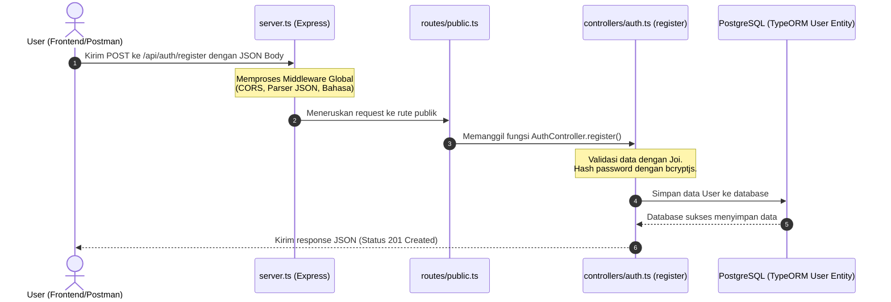

# 📘 Panduan Belajar & Dokumentasi Backend: Proyek `service-auth`

Selamat datang di proyek **`service-auth`**! Dokumen ini dirancang khusus untuk membantu kamu yang baru belajar backend Node.js menggunakan template ini. Di sini, kita akan membedah bagaimana kode bekerja, konsep dasar backend yang digunakan, serta bagaimana cara memperbaiki bug bawaan yang ada di template ini.

---

## 📌 Daftar Isi
1. [🧠 Kamus Istilah Backend (Glossary)](#1-kamus-istilah-backend-glossary)
2. [🛣️ Alur Jalannya Request (Request Lifecycle)](#2-alur-jalannya-request-request-lifecycle)
3. [📂 Memahami Struktur Folder Proyek](#3-memahami-struktur-folder-proyek)
4. [🗄️ Relasi Database & TypeORM (Entity)](#4-relasi-database--typeorm-entity)
5. [🔐 Sistem Otentikasi JWT (RS256)](#5-sistem-otentikasi-jwt-rs256)
6. [⚠️ Tutorial Memperbaiki Bug Bawaan (Learning by Fixing)](#6-tutorial-memperbaiki-bug-bawaan-learning-by-fixing)
7. [🚀 Langkah Menjalankan Aplikasi](#7-langkah-menjalankan-aplikasi)

---

## 1. 🧠 Kamus Istilah Backend (Glossary)

Sebelum masuk ke kode, berikut adalah beberapa istilah dasar yang wajib kamu ketahui:
*   **REST API**: Cara komunikasi antara client (web/mobile) dan server menggunakan protokol HTTP.
*   **Endpoint / Route**: URL alamat tujuan pada API (contoh: `/api/auth/login`).
*   **HTTP Method**: Jenis aksi yang dilakukan pada rute:
    *   `GET`: Mengambil data dari server.
    *   `POST`: Mengirim data baru ke server (biasanya registrasi, login, tambah produk).
    *   `PUT / PATCH`: Mengubah data yang sudah ada.
    *   `DELETE`: Menghapus data.
*   **Middleware**: Fungsi perantara yang berjalan **sebelum** request sampai ke controller (contoh: memeriksa apakah user sudah login, membatasi ukuran request, atau menerjemahkan bahasa).
*   **Controller**: Bagian kode yang berisi logika utama aplikasi (menerima request, memprosesnya, dan mengirim balik response).
*   **ORM (Object-Relational Mapping)**: Library (di sini menggunakan **TypeORM**) yang memungkinkan kita berinteraksi dengan database menggunakan objek JavaScript/TypeScript tanpa perlu menulis query SQL manual.
*   **Joi**: Library untuk memvalidasi format data yang dikirim user (misalnya memastikan email tidak kosong dan berformat benar).

---

## 2. 🛣️ Alur Jalannya Request (Request Lifecycle)

Mari kita ambil contoh alur saat seorang pengguna mendaftar lewat endpoint **`POST /api/auth/register`**:



---

## 3. 📂 Memahami Struktur Folder Proyek

Berikut adalah peta folder proyek ini beserta penjelasan fungsi belajarnya:

*   **`config/`**: Tempat menyimpan file konfigurasi JSON. Folder ini memisahkan konfigurasi untuk mode pengembangan (`default.json`) dan mode produksi (`prod.json`). Sangat berguna agar kita tidak menulis *credentials* database langsung di dalam kode.
*   **`src/index.ts`**: Pintu gerbang utama aplikasi. Di sini server Express dinyalakan pada port yang ditentukan dan mendengarkan request dari luar.
*   **`src/server.ts`**: Tempat merakit aplikasi Express. Semua middleware global didaftarkan di sini, koneksi database dinyalakan, dan rute-rute API dihubungkan.
*   **`src/routes/`**: Tempat mendaftarkan alamat URL (rute) API:
    *   `public.ts`: Rute bebas akses (seperti Login & Register).
    *   `private.ts`: Rute terkunci (harus membawa Token JWT untuk masuk).
*   **`src/controllers/`**: Tempat menulis logika bisnis utama. Di sini kamu akan sering coding untuk menerima input dari client, memanggil database, dan memberikan response.
*   **`src/entities/`**: Representasi tabel database. Di sini kamu menentukan kolom-kolom tabel database menggunakan TypeScript.
*   **`src/helpers/`**: Fungsi pembantu agar kode di controller tidak terlalu panjang. Contohnya: helper JWT untuk membuat token, helper database, dan helper format response.
*   **`src/langs/`**: Mengatur teks response multibahasa.

---

## 4. 🗄️ Relasi Database & TypeORM (Entity)

TypeORM menggunakan decorator untuk mendefinisikan tabel dan relasi antar tabel secara otomatis:

### 1. Entitas `User` ([User.ts](file:///home/wahyu/Downloads/template-be/service-auth/src/entities/User.ts))
Tabel untuk menyimpan data pengguna yang terdaftar.
*   `@PrimaryGeneratedColumn()`: Membuat kolom `id` otomatis bertambah (Auto-increment).
*   `@Column({ unique: true })`: Kolom `email` harus unik (tidak boleh ada 2 user dengan email sama).
*   `@OneToMany`: Menunjukkan hubungan **One-to-Many** dengan tabel `Transaction` (1 pengguna bisa memiliki banyak transaksi pembelian).

### 2. Entitas `Product` ([Product.ts](file:///home/wahyu/Downloads/template-be/service-auth/src/entities/Product.ts))
Tabel untuk menyimpan catalog produk.
*   `@DeleteDateColumn()`: Mengaktifkan fitur **Soft Delete**. Saat produk dihapus, baris data tidak benar-benar hilang dari database, melainkan hanya mengisi kolom `deletedAt` dengan tanggal penghapusan. Ini sangat penting untuk keamanan data transaksi lama.

---

## 5. 🔐 Sistem Otentikasi JWT (RS256)

### Bagaimana Cara Kerja Otentikasi di Proyek Ini?

1.  **Login Sukses**: Ketika user mengirim email & password yang benar ke `/api/auth/login`, server akan membuat **Access Token** menggunakan kunci rahasia asimetris **RS256** (menggunakan [private.key](file:///home/wahyu/Downloads/template-be/service-auth/src/helpers/key/private.key)).
2.  **Menyimpan Token**: Frontend menyimpan Token JWT ini.
3.  **Mengakses Rute Private**: Setiap kali frontend ingin mengakses data profil (`/api/auth/profile`), mereka harus menyertakan token tersebut pada header HTTP:
    ```text
    Authorization: Bearer <TOKEN_JWT_KAMU>
    ```
4.  **Verifikasi Token**: Server menggunakan [public.key](file:///home/wahyu/Downloads/template-be/service-auth/src/helpers/key/public.key) untuk mendekripsi dan memverifikasi token tersebut. Jika valid, request diteruskan ke controller. Jika palsu atau kedaluwarsa, server langsung membalas dengan error `403 Forbidden`.

---

## ⚠️ 6. Tutorial Memperbaiki Bug Bawaan (Learning by Fixing)

Sebagai bahan belajar pertama kamu, mari kita perbaiki bug bawaan yang ada di dalam template ini. Ikuti panduan langkah demi langkah di bawah:

### 🚨 Bug 1: Semua Endpoint Privat Mengembalikan Error 403 Forbidden
*   **Masalah**: Middleware di [jwt.ts](file:///home/wahyu/Downloads/template-be/service-auth/src/helpers/jwt.ts#L30) mengecek ID pengguna menggunakan `req.auth?.data.id`. Tetapi, saat login berhasil di [auth.ts](file:///home/wahyu/Downloads/template-be/service-auth/src/controllers/auth.ts#L97), payload token yang dibuat dimasukkan langsung ke root token (`{ id: user.id }` bukan `{ data: { id: user.id } }`).
*   **Cara Memperbaiki**:
    Buka file [src/helpers/jwt.ts](file:///home/wahyu/Downloads/template-be/service-auth/src/helpers/jwt.ts) dan cari baris ke-30:
    ```typescript
    // SEBELUM PERBAIKAN:
    if (!req.auth?.data.id) {
        return ReturnHelper.errorResponse(res, 403, 666, Language.lang.failed_access);
    }
    ```
    Ubah baris tersebut menjadi langsung membaca properti `id`:
    ```typescript
    // SESUDAH PERBAIKAN:
    if (!req.auth?.id) {
        return ReturnHelper.errorResponse(res, 403, 666, Language.lang.failed_access);
    }
    ```

---

### 🚨 Bug 2: Server Crash Saat Menjalankan Deteksi Mobile (`navigator is not defined`)
*   **Masalah**: Di file [utility.ts](file:///home/wahyu/Downloads/template-be/service-auth/src/helpers/express/utility.ts#L17), fungsi `Utility.isMobile` memanggil objek browser `navigator.userAgent`. Karena Node.js berjalan di sisi server (bukan browser), variabel `navigator` tidak pernah ada sehingga program langsung crash/error di runtime.
*   **Cara Memperbaiki**:
    Karena server harus membaca User-Agent dari request header Express, kita perlu mengubah fungsi agar menerima parameter request (`req`).
    Buka file [src/helpers/express/utility.ts](file:///home/wahyu/Downloads/template-be/service-auth/src/helpers/express/utility.ts) dan perbaiki baris ke-16 menjadi seperti ini:
    ```typescript
    // SESUDAH PERBAIKAN:
    static isMobile(req: any): boolean {
        const userAgent = (req.headers['user-agent'] || '').toLowerCase();

        // List of mobile device keywords
        const mobileDevices = [
            'iphone', 'ipod', 'ipad', 'android', 'blackberry', 'windows phone', 'mobile'
        ];

        // Check if the userAgent matches any mobile device keyword
        return mobileDevices.some(device => userAgent.includes(device));
    }
    ```

---

### 🚨 Bug 3: Gagal Update & Delete Produk Karena Salah Nama Properti ID
*   **Masalah**: Di dalam file [product.ts](file:///home/wahyu/Downloads/template-be/service-auth/src/controllers/product.ts#L85), divalidasi skema data masuk dengan nama properti `product_id`. Tetapi kode pencarian di database menggunakan `param.id` yang nilainya adalah `undefined`.
*   **Cara Memperbaiki**:
    1.  Buka file [src/controllers/product.ts](file:///home/wahyu/Downloads/template-be/service-auth/src/controllers/product.ts) dan cari baris ke-85 pada fungsi `update`:
        ```typescript
        // SEBELUM PERBAIKAN:
        const existingProduct = await productRepository.findOne({ where: { id: param.id } });
        ```
        Ganti menjadi:
        ```typescript
        // SESUDAH PERBAIKAN:
        const existingProduct = await productRepository.findOne({ where: { id: param.product_id } });
        ```
    2.  Lakukan hal serupa pada fungsi `delete` di baris ke-205:
        ```typescript
        // SEBELUM PERBAIKAN:
        const existingProduct = await productRepository.findOne({ where: { id: param.id } });
        ```
        Ganti menjadi:
        ```typescript
        // SESUDAH PERBAIKAN:
        const existingProduct = await productRepository.findOne({ where: { id: param.product_id } });
        ```

---

## 7. Langkah Menjalankan Aplikasi

1.  **Instalasi**: Download semua library pendukung melalui terminal:
    ```bash
    npm install
    ```
2.  **Generate Swagger**: Wajib membuat dokumentasi OpenAPI sebelum server dijalankan:
    ```bash
    npm run swagger
    ```
3.  **Jalankan Mode Development**:
    ```bash
    npm run dev
    ```
    Aplikasi akan menyala di `http://localhost:5000`. Kamu bisa membuka dokumentasi API interaktif untuk tes login dan register lewat browser di alamat `http://localhost:5000/api/docs`.
